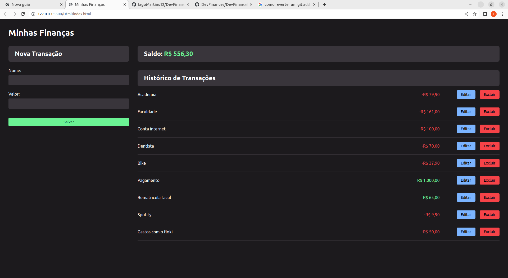

# DevFinances
Um Sistema de controle de finanças, criado para ajudar a ter uma noção dos seus gastos. 
Para esse sistema, foi construido uma api rest em cima de un servidor fake, gerado pelo json-server

# Tecnologias utilizadas no projeto: 
<ul>
    <li> JSON-Server </li>
    <li> API Rest </li>
    <li> CSS </li>
    <li> JavaScript(ES6+)  </li>
</ul>

# Requisitos para rodar na sua maquina: 
<ul>
    <li> Possuir o NodeJs instalado </li>
</ul>

# Como rodar na sua maquina? 

 Primerio, é necessario instalar as dependencias necessarias do projeto. Digite no seu terminal (dentro da pasta do projeto) o comando:  

´
npm init -y
´

 Após instalar as dependecias, é necessario colocar o servidor do json-server no ar. digite no seu terminal  

´npm run json-server´

 Pronto! o Projeto ja estará rodando na sua local :) 

# Imagem do projeto: 

